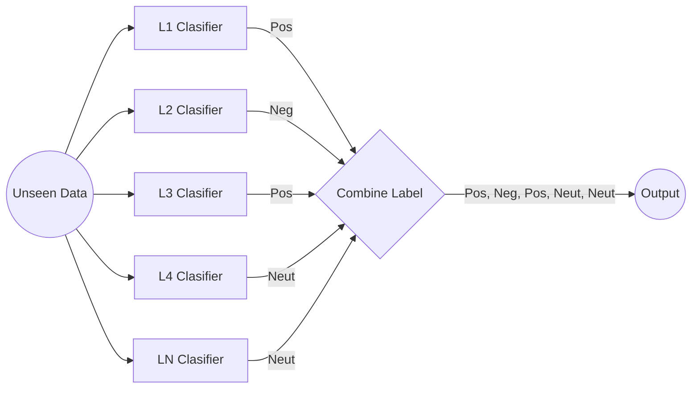

## ABSA
aspect based sentiment analysis
dataset: [HoASA by IndoNLP](https://github.com/IndoNLP/indonlu/tree/master/dataset/hoasa_absa-airy)

Merupakan permasalah multiclass-multioutput classification dimana terdapat dua pendekatan yang umum digunakan:

 1. Transformasi Permasalahan (Problem Transformation)
 2. Adaptasi Algoritma

Pada transformasi permasalahan terdapat 4 metode: 

 1. Binary Relevance, transform menjadi clasifikasi biner
 2. Calibrated Label Ranking, transform menjadi label rangking
 3. Clasifier Chain, menpredict satu label kemudian menggunakannya sebagai fitur untuk label selanjutnya
 4. Label Powerset, transform menjadi multiclass

## Binary Relavance

Dengan membentuk sebuah independent clasifier untuk setiap label, sehingga diperoleh L-clasifier dengan L adalah jumlah label. Kemudian kita dapat menggunakan setiap clasifier dan mengkombinasikan hasil clafisier untuk mempredict unseen data



## Ekplorasi Dataset

Dataset terdiri dari text review dan 10 aspek target yang mana setiap aspek terdiri dari 4 kategori: Neut (Netral), Pos (Positif), Neg (Negatif) dan Neg_pos (Campuran).

Pada dataset train terdapat total 2283 baris dengan imbalance dataset untuk target aspek. Seluruh aspek memiliki kategori Neutral lebih dari setengah dataset, serta untuk kategori Positif dan Negatif juga tidak imbang. Terlebih untuk kategori Campuran (neg_pos)  aspek ac, linen dan service hanya memiliki 1 sampel dan aspek kebersihan 6 sampel. Aspek lain tidak memiliki sampel. 

Dengan kondisi dataset demikian, dipastikan clasifier tidak dapat mengenali sentimen campuran dengan baik bahkan sama sekali tidak pada beberapa aspek.  Kita mencoba menggunakan metode 
**Binary Relavace** untuk menjaga performa clasifier dengan kondisi dataset sekarang. Perlu dilakukan pendekatan lebih lanjut terkait imbalance data.

## Metode
Tokenizer: 
 1. BoW
 2. TF-IDF 
 3. FastText

Classifier: 
 1. Naive Bayes
 2. Support Vector Machine 
 3. Logistic Regression

Tuning: GridSearch

## Hasil dan Analisa

### Hasil

|Vectorizer|Classifier|Average Accuracy|Time Predict|Time Train|Size Model / Aspect|
|--|--|--|--|--|--|
|BoW|Naive Bayes|0.903 |0.3s |2.2s |308KB|
|BoW|Support Vector Machine|**0.937** |0.7s |1m 5.5s| 457KB|
|BoW|Logistic Regression|0.936 |0.1s |4m 54.3s|239KB|
|TF-IDF|Naive Bayes|0.869 |0.04s |3.9s |456KB|
|TF-IDF|Support Vector Machine|0.935 |0.03s |1m 22.2s|636KB|
|TF-IDF|Logistic Regression|0.934 |**0.02s** |4m 24.8s|313KB|
|FastText|Naive Bayes|0.807 |100.79s |7m 6.4s |2,41GB|
|FastText|Support Vector Machine|0.818 |27.57s |15m 12.2s|2,42GB|
|FastText|Logistic Regression|0.825 |22.7s | 23m 8.2s| 2,41GB|

### Analisa
1. Akurasi terbaik diperoleh oleh BoW-SVM dengan 0.937, secara umum BoW dapat memberikan akurasi yang lebih baik daripada TF-IDF dan FastText
2. Kecepatan predict terbaik diperoleh oleh TFIDF-Logistic Regression dengan kecepatan **0.02s**, juga dengan akurasi tinggi **0.937**. Dengan hasil yang didapat sekarang **TFIDF-Logistic Regression** dapat menjadi pilihan terbaik untuk digunakan
3. FastText membutuhkan waktu dan komputasi yang lebih lama dan ukuran model yang sangat besar
4. Akurasi FastText masih memungkinkan untuk lebih ditingkatkan dengan transfer learning korpora yang lebih besar

## How to Use?
1. Clone the repo
```sh
   git clone https://github.com/Amal17/absa-playground.git
```
2. Open and Run playground.ipynb

## Step and Dokumentation

### 1. `train_and_test()`, train, test dan save model classifikasi
```sh
acc, categorical = train_and_test(data_train, data_valid, data_test, feature="bow", classifier="nb", save_path="model/train1")
```

**parameter:** 
		 - **data_train**, pandas.DataFrame untuk data train
		 - **data_valid**, pandas.DataFrame untuk data validasi
		 - **data_test**, pandas.DataFrame untuk data test
		 - **feature**, string: `'bow'`, `'tfidf'` atau `'fasttext'`. Untuk menentukan vectorizer yang akan digunakan
		 - **classifier**, string: `'nb'`, `'svm'` atau `'lr'`. Untuk menentukan metode clasifikasi. `nb`-> Naive Bayes, `svm`-> Support Vector Machine dan `lr`-> Logictic Regression  
		 - **save_path**, string: `path` untuk menyimpan vectorizer dan classifier, default=`None` untuk tidak menyimpan vectorizer dan classifier
		 - **ft_path**, string: `path`, jika menggunakan feature 	`fasttext`. Default=`"fasttext.ft"`. Jalankan function `train_fasttext` untuk train fasttext model
		 
**return:**
		- **average_acc**, int: rata-rata akurasi seluruh aspek
		- **categorical**, dict: {aspek:  dict: {f1 dan acc} }
		
	{'ac': {'f1': 0.00, 'acc': 0.00}, 'kebersihan': {'f1': 0.00, 'acc': 0.00}}		 

### 2. **`predict()`**, prediksi data baru
```sh
pred = predict(text, model_path="model/train1", classifier="nb", feature="bow")
```
**parameter:**
		 - **text**, string: input text yang akan diklasifikasi
		 - **model_path**, string: `path`, lokasi model yang digunakan
		 - **feature**, string: `'bow'`, `'tfidf'` atau `'fasttext'`. Untuk menentukan vectorizer yang akan digunakan
		 - **classifier**, string: `'nb'`, `'svm'` atau `'lr'`. Untuk menentukan metode clasifikasi.
		
**return:**
		 - **pred**, dict: {aspek: kategori}
				
	{'ac': 'neut', 'kebersihan': 'neg'}

 ### 3. `train_fasttext`, train FastText model
```sh
train_fasttext(data_train['review'], save_path='fasttext.ft')
```
**parameter:**
		 - **xtrain**, pandas Dataframe berupa text train
		 - **save_path**, string: `path` untuk menyimpan model FastText. Default=`'fasttext.ft'`
		

## Contributing

Contributions are what make the open source community such an amazing place to learn, inspire, and create. Any contributions you make are **greatly appreciated**.

If you have a suggestion that would make this better, please fork the repo and create a pull request. You can also simply open an issue with the tag "enhancement".
Don't forget to give the project a star! Thanks again!

1. Fork the Project
2. Create your Feature Branch (`git checkout -b feature/AmazingFeature`)
3. Commit your Changes (`git commit -m 'Add some AmazingFeature'`)
4. Push to the Branch (`git push origin feature/AmazingFeature`)
5. Open a Pull Request


## License

Distributed under the MIT License. See `licence.txt` for more information.


## Contact

Project Link: [Amal17/absa-playground](https://github.com/Amal17/absa-playground)


## Acknowledgments

* [IndoNLP/IndoLU](https://github.com/IndoNLP/indonlu)